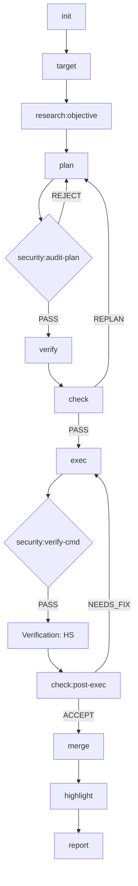
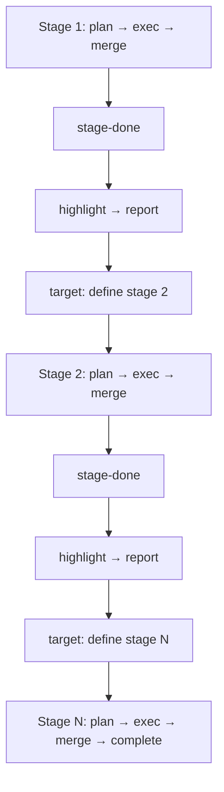

# Moonview

[中文文档](README_CN.md)

A plugin marketplace for structured task lifecycle management.

> *"Standing on the moon, looking at Earth"* — [老王来了@dlw2023](https://www.youtube.com/@dlw2023)

## Installation

Add the Moonview marketplace to your preferred agent:

```bash
# Gemini CLI
gemini plugin add huacheng/moonview

# Claude Code
claude plugin add huacheng/moonview

# Codex CLI
codex plugin add huacheng/moonview
```

## Plugins

### task-ai (v0.9.0)

## I. Overview

task-ai is a **pure Markdown instruction-driven** task lifecycle management framework. It runs as a model-agnostic plugin, managing the full lifecycle from task initialization to completion reports. The framework supports domain-adaptive verification (VFP protocol), cross-task knowledge reuse, progressive multi-stage targets, and highly automated autonomous execution.

**Core philosophy**: "Task as Notebook". Every task is bound to an independent Notebook structure, ensuring clear responsibility boundaries and complete audit trails.

**Entry command**: `/task-ai:<subcommand> [args]`

---

## II. 18 Sub-commands

### Core Lifecycle (in typical order)

| Sub-command | Tier | Role | Notes |
|-------------|------|------|-------|
| `init` | light | Initialize working directory and git branch | Requires `<project> <notebook>` |
| `target` | heavy | **Define/review task objectives** | Bidirectional sync with `.target.md`; stage advance routing |
| `research` | heavy | Intelligence collection, type discovery | Independently callable at any phase |
| `plan` | heavy | Generate implementation plan `.plan.md` | Auto-generates VH verification stubs |
| `verify` | medium | Run domain-adapted tests (VH/CGG) | Produces test result files |
| `check` | heavy | Plan/execution review and gating | Three checkpoints control state transitions |
| `exec` | heavy | Step-by-step plan execution | Follows VFP protocol (Red → Green → Refactor) |
| `merge` | medium | Merge task branch to main | Routes to `stage-done` or `complete` based on stage progress |
| `highlight` | medium | **Experience distillation** | Scope-based modes: complete / focused / stage-aware |
| `report` | medium | Generate completion report | Available at any status for progress documentation |

### Auxiliary & System Commands

| Sub-command | Tier | Role |
|-------------|------|------|
| `read` | medium | **System Immunity**: safely ingest knowledge from external docs/URLs into library. |
| `security` | heavy | **Security Gateway**: pre-audit plans and verify high-risk commands. |
| `auto` | heavy | Autonomous execution loop: single-session orchestration via `.auto-signal`. |
| `cancel` | light | Cancel task, clean up state. |
| `list` | light | Query task inventory, dependency graph, and task status. |
| `annotate` | medium | Process interactive annotations from the Plan panel. |
| `summarize` | light | Regenerate `.summary.md` for compressed context. |
| `library` | light | Knowledge library management (search, rebuild index, archive maintenance). |

### Simplified Arguments

Apart from `init` which requires explicit project/task names at launch, all other commands auto-detect context via **path sniffing** and **git branch matching** — no manual arguments needed.

### Typical Sub-command Flow

#### 1. Standard Heavy Task


#### 2. Progressive Target (Multi-Stage)


#### 3. Auxiliary & Global Commands
- **`auto`**: Wraps the standard flow, auto-driven via `.auto-signal`.
- **`read`**: Globally callable, feeds knowledge into `.library`.
- **`list` / `summarize` / `library`**: Status and management tools, available anytime.

---

## III. State Machine (9 states, 41 transitions)

```
draft → planning → review → executing → complete
                 ↗            ↘
          re-planning    ←    blocked
                               ↑
executing → stage-done → planning (next stage)
                      → cancelled
```

### Key Design Constraints
1. **Progressive target**: Tasks with `stage.total > 1` proceed through multiple `plan → exec → merge → stage-done` cycles before reaching `complete`.
2. **Security first**: All `exec` operations must pass `security` validation before execution.
3. **`stage-done` is non-terminal**: Enables `target` (advance to next stage), `cancel`, `report`, and `highlight`, but rejects `plan`, `exec`, and `annotate`.

---

## IV. Quality Assurance

### Verification-First Protocol (VFP)
The framework enforces a **Verification-First Protocol**:
- **VH (Verification Hypothesis)**: Define failure baselines during the planning phase.
- **HS (Hypothesis Satisfied)**: Verify success after implementation.
- **CGG (Cumulative Green Gate)**: Every modification must pass full regression.

### Test Strategy by Task Type
A unified type→test strategy mapping (`test-strategy-by-type.md`) provides:
- **Strategy Matrix**: Test approach by (task type × fix category) — covers software, ai-skill, data-pipeline, documentation, infrastructure, science/ml, and more.
- **Test Classification Rules**: Runtime code → functional test, spec text → contract test, fixture data → property test, cross-reference → completeness test, stale content → absence test.
- **Regression Test Protocol**: Every fix follows RED → GREEN → full suite, with documented exemptions for trivial changes.

### Six-Dimension Audit (D1–D6)
The built-in `.dev/validate.sh` (61 contract tests across L1/L2/L3) performs deep checks across six orthogonal dimensions:

| Dimension | Focus |
|-----------|-------|
| **D1 Correctness** | Requirements coverage, functional logic, data flow |
| **D2 Security** | Injection protection, permissions, concurrency safety, stale-lock recovery |
| **D3 Reliability** | Boundary handling, fault recovery, trap cleanup, idempotency |
| **D4 Performance** | Resource consumption, I/O efficiency, growth control |
| **D5 Architecture** | Module boundaries, extension points, interface contracts, prod/test separation |
| **D6 Maintainability** | Readability, terminology consistency, naming conventions, deduplication |

---

## V. Core Infrastructure

### Shared References (15 protocol files)
Authoritative protocol documents in `commands/references/` — single source of truth for cross-cutting concerns:

| Reference | Purpose |
|-----------|---------|
| `verification-first-protocol.md` | VFP v1.0 — VH lifecycle, CGG, HIL, compliance scoring |
| `test-strategy-by-type.md` | Unified type→test strategy matrix and regression protocol |
| `state-matrix.md` | Complete state × command matrix |
| `concurrency.md` | Lock protocol, shared dir protection, lock ordering |
| `directory-convention.md` | Full directory tree and path resolution |
| `git-details.md` | Branch/commit conventions, worktree, rollback |
| `model-routing.md` | Tier definitions (heavy/medium/light), routing table |
| `progressive-target.md` | Multi-stage objective refinement |
| `annotation-format.md` | JSONL annotation format (Insert/Delete/Replace/Comment) |
| ... | + 6 more (library protocols, type field, summary formats, etc.) |

### Runtime Modules (`core/`)

| Module | Role |
|--------|------|
| `state.py` | State machine CLI — transitions, locking (`O_CREAT\|O_EXCL`), stale-lock recovery (PID check), JSONDecodeError handling, `--stage` arguments |
| `lib.sh` | Production runtime library — `resolve_workdir()` for shared working directory resolution across all skill scripts |
| `frontmatter.py` | Shared YAML-like frontmatter parser with multi-line list support |

### Model Agnostic
- No hard-coded references to specific LLM names; uses generic `the agent`.
- Supports multiple CLI environments (Gemini CLI / Claude Code / Codex CLI, etc.).

### Environment Variables

| Variable | Default | Description |
|----------|---------|-------------|
| `NB_WORKSPACES_ROOT` | `/home/user/nb-workspaces` | Root directory for all projects and notebooks |
| `NB_WORKSPACES_LIBRARY` | `$NB_WORKSPACES_ROOT/.library` | Shared knowledge library directory |

---

## VI. Current Statistics

| Metric | Value | Notes |
|--------|-------|-------|
| Sub-commands | 18 | Full coverage from research to delivery |
| Contract tests | **846 PASS, 0 FAIL** | 27 L1 (structural) + 29 L2 (functional) + 4 L3 (graph analysis) + 1 meta |
| Shared references | 15 | Authoritative protocol documents |
| State machine | 9 states, 41 transitions | Including `stage-done` for progressive targets |
| Documentation | 100% coverage | Every skill has a complete SKILL.md |

---

## Quick Start

```bash
# 1. Initialize a notebook under a project
/task-ai:init my-project auth-refactor --title "Refactor auth to JWT"

# 2. Write requirements in .target.md, then let research deepen them
/task-ai:research my-project/auth-refactor --caller target

# 3. Generate plan
/task-ai:plan auth-refactor --generate

# 4. Verify → check plan quality
/task-ai:verify auth-refactor
/task-ai:check auth-refactor --checkpoint post-plan

# 5. Execute the plan
/task-ai:exec auth-refactor

# 6. Merge to main + distill experience + generate report
/task-ai:merge auth-refactor
/task-ai:highlight auth-refactor
/task-ai:report auth-refactor

# Or run the full lifecycle automatically:
/task-ai:auto auth-refactor --start
```

---
*Summary auto-generated and verified by task-ai (v0.9.0).*

## Related

- [ai-cli-online](https://github.com/huacheng/ai-cli-online) — Web interface with Plan annotation panel and Chat editor

## License

MIT
