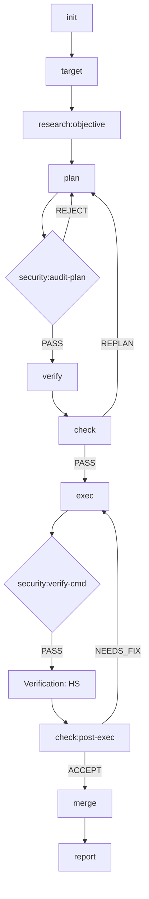
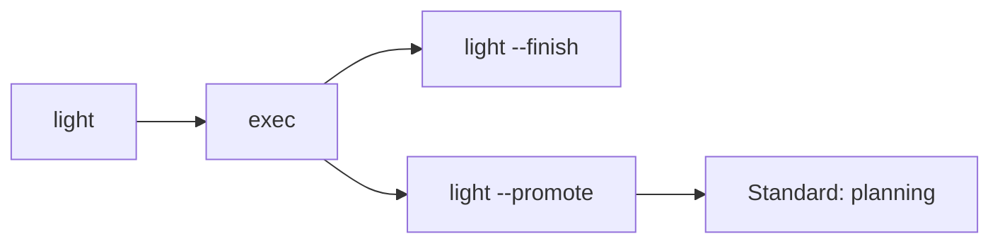

# Moonview

[中文文档](README_CN.md)

A plugin marketplace for structured task lifecycle management.

> *"Standing on the moon, looking at Earth"* — [老王来了@dlw2023](https://www.youtube.com/@dlw2023)

## Installation

Add the Moonview marketplace to your preferred agent:

```bash
# Gemini CLI
gemini plugin add huacheng/moonview

# Claude Code
claude plugin add huacheng/moonview

# Codex CLI
codex plugin add huacheng/moonview
```

## Plugins

### task-ai (v0.8.1)

## I. Overview

task-ai is a **pure Markdown instruction-driven** task lifecycle management framework. It runs as a model-agnostic plugin, managing the complete lifecycle from task initialization to completion reporting. The framework supports domain-adaptive verification (VFP protocol), cross-task knowledge reuse, and highly automated autonomous execution.

**Core philosophy**: "Task as Notebook". Every task is bound to an independent Notebook structure, ensuring clear responsibility boundaries and complete audit trails.

**Entry command**: Type `/moonview:<subcommand> [args]` in the prompt

---

## II. 18 Skills

### Core Lifecycle (typical order)

| Skill | Tier | Role | Notes |
|-------|------|------|-------|
| `init` | light | Initialize working directory, Git branch | Requires `<project> <notebook>` |
| `target` | heavy | **Define/review task objectives** | Bidirectional sync with `.target.md` |
| `research` | heavy | Intelligence gathering, type discovery | Callable independently at any phase |
| `plan` | heavy | Generate implementation plan `.plan.md` | Auto-generates VH verification stubs |
| `verify` | medium | Run domain-adapted tests (VH/CGG) | Produces test result files |
| `check` | heavy | Plan/execution review and gating | Three checkpoints control state transitions |
| `exec` | heavy | Step-by-step plan execution | Follows VFP protocol (Red → Green → Refactor) |
| `merge` | medium | Merge task branch, clean up metadata | Auto-deletes task branch |
| `report` | medium | Generate completion report, distill experience | Syncs knowledge to `.library` |

### Auxiliary & System Commands

| Skill | Tier | Role |
|-------|------|------|
| `light` | light | **Shadow Task**: blitz mode, transient notebook, auto-cleanup on completion |
| `read` | medium | **System Immunity**: safely ingest external docs/URLs into the library |
| `security` | heavy | **Security Gateway**: pre-audit plans and validate high-risk commands |
| `auto` | heavy | Autonomous execution loop: single-session orchestration via `.auto-signal` |
| `cancel` | light | Cancel task, clean up state |
| `list` | light | Query task inventory, dependency graph, and shadow task status |
| `annotate` | medium | Process interactive annotations from the Plan panel |
| `summarize` | light | Regenerate `.summary.md` for context compression |
| `library` | light | Knowledge library management (search, reindex, archive maintenance) |

### Auto Context Detection

Except for `init` and `light` (which require project/task names), all commands auto-detect context via **Git branch** (`task/<notebook>`) or **working directory path** — no manual arguments needed.

### Quick Start

```bash
# 1. Initialize a task (creates branch and switches to it)
/moonview:init my-project auth-refactor --title "Refactor auth to JWT"

# 2. Define objectives, let research deepen them (auto-detects context)
/moonview:target "Refactor auth module from session cookies to JWT"
/moonview:research --caller target

# 3. Generate plan → review → execute → merge → report
/moonview:plan --generate
/moonview:check --checkpoint post-plan
/moonview:exec
/moonview:merge
/moonview:report

# Or run the full lifecycle automatically:
/moonview:auto --start
```

### Lifecycle Flow Diagrams

#### 1. Standard Path



#### 2. Light Path (Shadow Task)



#### 3. Auxiliary & Global Commands

- **`auto`**: Wraps the standard path, driven by `.auto-signal` file
- **`read`**: Global — ingest external docs into `.library`
- **`list` / `summarize` / `library`**: Status and management tools (available anytime)

---

## III. State Machine (9 states, 23 transitions)

### Transition Diagram

```
                        ┌─────────────────────────────────────┐
                        ▼                                     │
draft ──→ planning ──→ review ──→ executing ──→ complete      │
            ▲  │  ▲      │          │  │                      │
            │  └──┘      │          │  ▼                      │
            │ (self)     │       re-planning                  │
            │            │          ▲  │  ▲                   │
            ├────────────┼──────────┘  └──┘                   │
            │            │            (self)                   │
            │            ▼                                     │
            ├───────── blocked                                │
            │                                                  │
light-exec ─┤──────────────────────────────────→ complete      │
            │                                                  │
            └── any non-terminal ──────────────→ cancelled ◉  │
                                                               │
                                                complete ◉ ◄──┘
```

### 9 States

| State | Description |
|-------|-------------|
| `draft` | Initial state — entered after `init` |
| `planning` | Plan generation in progress (supports self-loop revision) |
| `review` | Plan passed `check`, awaiting execution |
| `executing` | Step-by-step plan implementation |
| `re-planning` | Issues found during execution, re-planning (supports self-loop) |
| `blocked` | External dependency blocked, recoverable to `planning` |
| `light-exec` | `light` mode exclusive — shadow task execution |
| `complete` ◉ | Terminal: task completed |
| `cancelled` ◉ | Terminal: task cancelled |

### Key Design Constraints

1. **Light limits**: If a `light` mode task modifies > 3 files or fails > 3 times, it must `--promote` to the standard workflow
2. **Notebook binding**: Even `light` mode creates a temporary Notebook directory to host state
3. **Security first**: All `exec` runs must pass `security` validation

---

## IV. VFP Protocol & Quality Assurance

### Verification-First Protocol (VFP)

The framework enforces **Verification-First Protocol**:
- **VH (Verification Hypothesis)**: Define failure baselines during planning
- **HS (Hypothesis Satisfied)**: Verify success after implementation
- **CGG (Cumulative Green Gate)**: Every change must pass full regression

### Automated Audit (Six-Perspective Audit)

Built-in `.dev/validate.sh` performs six-dimension deep checks across all 18 skills:
1. **Structural consistency**: Step numbering, cross-references
2. **Routing compliance**: `.auto-signal` state machine transitions
3. **Technical integrity**: Lock mechanisms, data flow closure
4. **Functional robustness**: TDD contract test coverage
5. **Security protection**: 10-category injection sanitization, path traversal defense
6. **Protocol compliance**: Authoritative protocol section (`§`) references

---

## V. Features

- **Project hierarchy** — `$NB_WORKSPACES_ROOT/<project>/<notebook>/` two-level organization
- **18 skills** — full lifecycle from init to report, plus utility commands
- **Auto context detection** — after `init`, all commands auto-detect notebook via Git branch (`task/<notebook>`) or working directory path — no manual args needed
- **Domain-aware** — 19 seed types (software, science:\*, image-processing, video-production, DSP, literary, screenwriting, mechatronics, chip-design, ...) with auto-discovery and hybrid support (`data-pipeline|ml`)
- **Knowledge library** — `.library/.memory/` with experiences, references, type profiles, and thinking patterns across tasks
- **Git integration** — branch-per-task, worktree isolation for parallel execution, structured commit messages
- **Annotation-driven** — frontend Plan panel annotations processed into plan updates
- **Auto mode** — single-session autonomous orchestration with stall detection, dependency gate (`depends_on`), context quota, plugin delegation
- **Six-perspective audit** — check skill evaluates plans and implementations from 6 independent viewpoints
- **Research intelligence** — standalone callable at every phase for domain knowledge, requirement deepening, testing methodology
- **Concurrency protection** — atomic `O_CREAT|O_EXCL` lock with 6-priority ordering and stale lock recovery
- **Contract test suite** — 632 assertions (L1 structural + L2 functional) covering all skills, scripts, and state transitions
- **Security hardening** — fixed-string path comparison, input sanitization (tags, title, awk), validated `find()` results

## VI. Environment Variables

| Variable | Default | Description |
|----------|---------|-------------|
| `NB_WORKSPACES_ROOT` | `$HOME/nb-workspaces` | Root directory for all projects and notebooks |
| `NB_WORKSPACES_LIBRARY` | `$NB_WORKSPACES_ROOT/.library` | Shared knowledge library directory |

## VII. Compatibility

### Model Agnostic
- No hardcoded references to any specific LLM
- Uses generic terminology (`the agent`) instead of model-specific names
- Documentation fully in English, prompts support multiple CLI environments (Gemini/Claude Code/Codex)

### Infrastructure
- **No inline Python**: All Bash scripts operate data through standalone utilities (`state.py`, `json_get.py`) — no Python embedded in shell
- **Shared function library**: `lib.sh` provides `resolve_workdir()`, `find_nb_context()` and other shared functions, called uniformly by 9 scripts

---

## VIII. Current Stats

| Metric | Value | Notes |
|--------|-------|-------|
| Total skills | 18 | Covers full lifecycle from research to delivery |
| Contract tests | **632 PASS** (L1: 421, L2: 211) | 0 FAIL, 0 ERROR |
| State machine states | 9 | Including light-exec extension |
| Documentation coverage | 100% | Every skill has a complete SKILL.md |

---
*Generated and verified by task-ai (v0.8.1).*

## Related

- [ai-cli-online](https://github.com/huacheng/ai-cli-online) — Web interface with Plan annotation panel and Chat editor

## License

MIT
