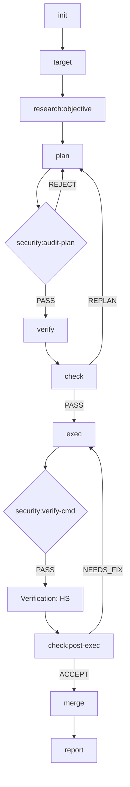
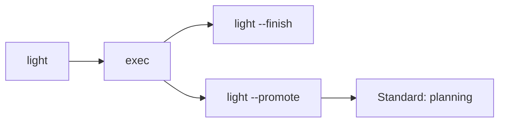

# Moonview

[中文文档](README_CN.md)

A Claude Code plugin marketplace for structured task lifecycle management.

> *"Standing on the moon, looking at Earth"* — [老王来了@dlw2023](https://www.youtube.com/@dlw2023)

## Installation

Add the Moonview marketplace to your preferred agent:

```bash
# For Gemini CLI
gemini plugin add huacheng/moonview

# For Claude Code
claude plugin add huacheng/moonview

# For Codex CLI
codex plugin add huacheng/moonview
```

## Plugins

### task-ai (v0.8.1)

Structured task lifecycle management with **18 skills** for AI-driven development. Git-integrated branch-per-task workflow with project/notebook hierarchy, domain-aware verification, knowledge library, and autonomous execution.

```
/moonview:task-ai <subcommand> [args]
```

## Lifecycle

### 1. Standard Path



### 2. Light Path (Shadow Task)



### 3. Auxiliary Commands

- **`auto`**: Wraps the standard path, driven by `.auto-signal` file
- **`read`**: Global — ingest external docs into `.library`
- **`research`**: Callable at every phase for domain knowledge and methodology
- **`list` · `summarize` · `library`**: Status and management tools (available anytime)

### Skills (18)

| Skill | Tier | Description |
|-------|------|-------------|
| `init` | light | Create notebook — directory, git branch, optional worktree |
| `target` | heavy | **Demand Anchor** — define/review objectives in .target.md |
| `light` | light | **Shadow Task** — fast-track fixes, transient notebook |
| `read` | medium | **System Immunity** — ingest local docs safely |
| `security` | heavy | **Runtime Guardian** — audit plans and commands |
| `research` | heavy | Intelligence officer — target deepening, reference collection, type discovery |
| `plan` | heavy | Generate implementation plan from `.target.md` with domain-adapted methodology |
| `verify` | medium | Run domain-adapted tests, produce result files |
| `check` | heavy | Six-perspective audit at post-plan, mid-exec, post-exec checkpoints |
| `exec` | heavy | Execute plan step-by-step with per-step verification |
| `merge` | medium | Merge task branch to main with conflict resolution (up to 3 retries) |
| `report` | medium | Generate completion report, distill experience to knowledge library |
| `auto` | heavy | Autonomous loop: plan → verify → check → exec → merge → report |
| `cancel` | light | Cancel task, optionally cleanup worktree and branch |
| `list` | light | Query task status, dependency graph, status timeline (read-only) |
| `annotate` | medium | Process Plan panel annotations (Insert/Delete/Replace/Comment) |
| `summarize` | light | Regenerate `.summary.md` for context recovery |
| `library` | light | Knowledge library management (search/list/status/maintain) |

### Status State Machine (9 states, 23 transitions)

```
                        ┌─────────────────────────────────────┐
                        ▼                                     │
draft ──→ planning ──→ review ──→ executing ──→ complete      │
            ▲  │  ▲      │          │  │                      │
            │  └──┘      │          │  ▼                      │
            │ (self)     │       re-planning                  │
            │            │          ▲  │  ▲                   │
            ├────────────┼──────────┘  └──┘                   │
            │            │            (self)                   │
            │            ▼                                     │
            ├───────── blocked                                │
            │                                                  │
light-exec ─┤──────────────────────────────────→ complete      │
            │                                                  │
            └── any non-terminal ──────────────→ cancelled ◉  │
                                                               │
                                                complete ◉ ◄──┘
```

9 statuses — `draft`, `planning`, `review`, `executing`, `re-planning`, `blocked`, `light-exec`, `complete`, `cancelled`. Terminal: `complete` ◉, `cancelled` ◉.

## Quick Start

```bash
# 1. Initialize a notebook under a project (creates branch + switches to it)
/moonview:init my-project auth-refactor --title "Refactor auth to JWT"

# 2. Define objectives, then let research deepen them
#    (auto-detects context from branch — no notebook arg needed)
/moonview:target "Refactor auth module from session cookies to JWT"
/moonview:research --caller target

# 3. Generate plan
/moonview:plan --generate

# 4. Verify → check plan quality
/moonview:verify
/moonview:check --checkpoint post-plan

# 5. Execute the plan
/moonview:exec

# 6. Merge to main + generate report
/moonview:merge
/moonview:report

# Or run the full lifecycle automatically (from step 2 onward):
/moonview:auto --start
```

> After `init`, all commands auto-detect the active notebook via Git branch (`task/<notebook>`) or working directory path. No need to pass the notebook name.

## Features

- **Project hierarchy** — `$NB_WORKSPACES_ROOT/<project>/<notebook>/` two-level organization
- **18 skills** — full lifecycle from init to report, plus utility commands
- **Auto context detection** — after `init`, all commands auto-detect notebook via Git branch (`task/<notebook>`) or working directory path — no manual args needed
- **Domain-aware** — 19 seed types (software, science:\*, image-processing, video-production, DSP, literary, screenwriting, mechatronics, chip-design, ...) with auto-discovery and hybrid support (`data-pipeline|ml`)
- **Knowledge library** — `.library/.memory/` with experiences, references, type profiles, and thinking patterns across tasks
- **Git integration** — branch-per-task, worktree isolation for parallel execution, structured commit messages
- **Annotation-driven** — frontend Plan panel annotations processed into plan updates
- **Auto mode** — single-session autonomous orchestration with stall detection, dependency gate (`depends_on`), context quota, plugin delegation
- **Six-perspective audit** — check skill evaluates plans and implementations from 6 independent viewpoints
- **Research intelligence** — standalone callable at every phase for domain knowledge, requirement deepening, testing methodology
- **Concurrency protection** — atomic `O_CREAT|O_EXCL` lock with 6-priority ordering and stale lock recovery
- **Contract test suite** — 632 assertions (L1 structural + L2 functional) covering all skills, scripts, and state transitions
- **Security hardening** — fixed-string path comparison, input sanitization (tags, title, awk), validated `find()` results

## Environment Variables

| Variable | Default | Description |
|----------|---------|-------------|
| `NB_WORKSPACES_ROOT` | `$HOME/nb-workspaces` | Root directory for all projects and notebooks |
| `NB_WORKSPACES_LIBRARY` | `$NB_WORKSPACES_ROOT/.library` | Shared knowledge library directory |

## Related

- [ai-cli-online](https://github.com/huacheng/ai-cli-online) — Web interface  with Plan annotation panel and Chat editor

## License

MIT
